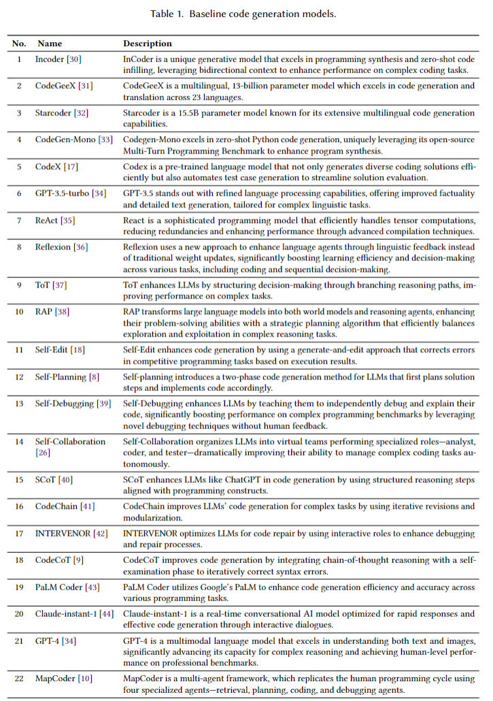
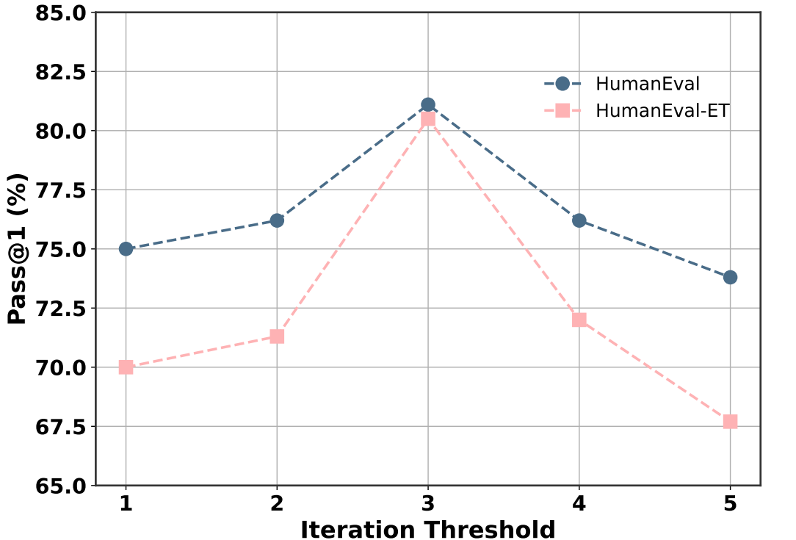

# CodeCoR

This repository contains the implementation and supplementary resources for the CodeCoR framework, as described in our paper.

The framework, CodeCoR, aims to a self-reflective multi-agent framework that evaluates the effectiveness of each agent and their collaborations. Below is an overview of the directory structure and contents, organized to facilitate replication and further experimentation.

### Directory Structure

**CodeCoR_agent**

This directory contains the core implementation of the agents in the CodeCoR framework. Each agent is responsible for a distinct phase in the code generation process, such as prompt generation, testing, and code repair. The modular structure allows for easy modification and experimentation with individual agent behaviors.

**dataset**

The dataset directory houses all the datasets used in the experiments. These datasets are integral to evaluating the performance and robustness of the CodeCoR framework. Each file in this directory has been preprocessed to conform to the framework’s requirements, ensuring consistency and repeatability of experimental results.

**experiments**

This directory includes the experimental code and configurations. 

**image**

The image directory contains visual representations, such as diagrams and flowcharts, illustrating the principles and workflow of the CodeCoR framework. These images provide insight into the system architecture and the interaction between the agents, supplementing the explanations provided in the paper.

**utils**

This directory provides utility scripts and helper functions essential for the CodeCoR framework's operation. These scripts support data preprocessing, performance logging, and result visualization, ensuring smooth execution and facilitating further development.

### Prompts

The diagram below elucidates the prompt generation mechanism within the CodeCoR framework:

The diagram shows the pruning prompts of agents and the workflow for pruning the low-quality outputs.

### Baseline

The table below delineates the baseline configuration employed for comparative evaluation, providing a reference for the framework's performance metrics:

### Can CodeCoR work with other LLMs?

In Section 5.1, we use GPT-3.5-turbo to evaluate the generality of CodeCoR. This section evaluates and assesses the performance of various methods applied to two powerful LLMs: CodeLlama [rozière2024codellamaopenfoundation] and GPT-4 [openai2024gpt4technicalreport]. CodeLlama is a specialized model designed for coding tasks, equipped with advanced training techniques such as infilling and long context handling. Conversely, GPT-4 is a multi-modal model that excels in text comprehension and demonstrates exceptional prowess in complex reasoning tasks.

#### Comparison of different methods on HumanEval and HumanEval-ET datasets

| **Method**     | **GPT-4 HumanEval** | **GPT-4 HumanEval-ET** | **CodeLlama (34B) HumanEval** | **CodeLlama (34B) HumanEval-ET** |
|----------------|---------------------|------------------------|-------------------------------|----------------------------------|
| CodeChain      | 89.0                | 61.6                   | 15.9                          | 14.0                             |
| SCoT           | 78.9                | 69.5                   | 17.4                          | 14.9                             |
| Self-Planning  | 83.5                | 76.8                   | 22.6                          | 20.1                             |
| CodeCoT        | 86.6                | 77.4                   | 34.1                          | 29.9                             |
| ChatDev        | 84.1                | 72.7                   | 23.6                          | 20.6                             |
| MetaGPT        | 85.9                | 74.0                   | 26.5                          | 23.1                             |
| MapCoder       | 93.9                | 82.9                   | 42.7                          | 37.0                             |
| CodeCoR        | **94.5**            | **83.5**               | **43.9**                      | **37.8**                         |

As illustrated in the table above, we observe the performance of various prompting methods on the CodeLlama model. For instance, in the HumanEval dataset, CodeCoR achieves a score of 43.9%, which surpasses CodeCoT's 34.1%, Self-Planning's 22.6%, SCoT's 17.4%, and CodeChain's 15.9%. Similarly, in the HumanEval-ET dataset, CodeCoR scores 37.8%, outperforming all other prompting methods. On the MBPP and MBPP-ET datasets, CodeCoR also leads with scores of 40.6% and 32.3%, respectively. This further substantiates CodeCoR's superior performance across various benchmarks when applied to the CodeLlama model.

To demonstrate the practical applicability of CodeCoR, we tested the framework on various datasets including HumanEval and HumanEval-ET using GPT-4. The results indicated significant improvements in accuracy compared to existing methods. For instance, on the HumanEval dataset, CodeCoR achieved a Pass@1 accuracy of 94.5%, and on the HumanEval-ET dataset, it achieved 83.5%. These results are significantly higher compared to other methods such as CodeChain, SCoT, Self-Planning, and CodeCoT, as shown in the table above.

### What are the cost implications of CodeCoR? (RQ3)

The cost implications of most multi-agent frameworks are much higher than that of single-agent frameworks. Therefore, in terms of studying cost implications, we selected three single-agent methods and one multi-agent method to compare with CodeCoR. The table below provides an empirical assessment of various code generation frameworks—CodeCoR, MapCoder, CodeChain, SCoT, and Self-Planning. The experiment was conducted in a Python environment using the first ten programming problems from the HumanEval dataset. We employed [psutil](https://pypi.org/project/psutil/) for monitoring costs, recording execution time, CPU usage, memory usage, disk I/O, and network I/O on a dedicated server to minimize external interference.

#### Cost comparison of code generation models

| Method         | Run Time (s) | CPU Usage (%) | Memory Usage (GB) | Disk Read (MB) | Disk Write (MB) | Net Send (MB) | Net Receive (MB) |
|----------------|--------------|---------------|-------------------|----------------|-----------------|---------------|------------------|
| CodeCoR       | 123.69       | 0.8           | 0.01              | 0.36           | 11.49           | 0.14          | 0.30             |
| MapCoder      | 166.45       | 0.8           | 0.02              | 0.48           | 12.78           | 0.25          | 0.36             |
| CodeChain     | 121.80       | 0.4           | 0.01              | 1.25           | 16.21           | 0.16          | 0.22             |
| SCoT          | 251.79       | 5.2           | 0.21              | 55.32          | 162.90          | 0.72          | 1.15             |
| Self-Planning | 242.92       | 0.2           | 0.02              | 1.02           | 31.16           | 0.35          | 0.74             |

In terms of runtime, CodeCoR exhibits superior performance with a time cost of 123.69 seconds, significantly outperforming SCoT and Self-Planning (251.79 s and 242.92 s, respectively). Moreover, both CodeCoR and MapCoder maintain a low CPU usage rate of 0.8%, compared to SCoT’s 5.2%. Memory usage is also minimal for CodeCoR (0.01 GB), while SCoT consumes 0.21 GB. Regarding disk I/O, CodeCoR writes only 11.49 MB compared to SCoT’s 162.90 MB. Analysis of network traffic reveals that CodeCoR, along with the other frameworks, achieves a balanced use of network resources.

Overall, these results demonstrate that CodeCoR incurs lower costs than other code generation frameworks—thanks to efficient task decomposition, effective pruning strategies, and parallel processing capabilities.

**Answer (RQ3):**  
Our CodeCoR framework incurs less code generation runtime than other representative LLM-based models, and it does not require high usage of computational resources such as CPU, memory, disk I/O, or network bandwidth.

---

### Why does CodeCoR work?

The efficacy of CodeCoR can be attributed to its innovative multi-agent architecture, which enhances specialization and collaboration across different stages of the code generation process. By designating specialized agents for generating CoT prompts, synthesizing code, creating test cases, and repairing code, each task is executed by an agent optimized for that specific function, thereby improving both efficiency and accuracy.

Furthermore, an iterative feedback mechanism enables agents to continually test and refine the generated code based on local execution feedback, progressively minimizing both semantic and syntactical errors. A key component is the Repair Agent, which continuously monitors and corrects errors. For example, the diagram below illustrates that when a Repair Agent is not utilized, an unnecessary conditional check leads to test case failures; with the Repair Agent, the code is corrected to be both syntactically and semantically accurate.

In summary, CodeCoR’s promising results arise from its self-reflective multi-agent framework that enhances specialization and collaboration, an effective iterative feedback mechanism, and robust error detection and correction capabilities.

---

### How does the number of repair rounds affect the performance of the agents?

In CodeCoR, the number of repair rounds is a key factor influencing performance. The code repair process for each snippet is halted when further repairs do not yield additional test case passes. In our experiment, we limited the number of repair rounds to various fixed values. The figure below shows that the overall performance of the four agents peaks when the number of repair rounds is set to 3.

---

### Threats to Validity

While our study demonstrates promising results, several potential threats to validity remain:

- **Experimental Variability:** Despite using a consistent experimental setup, minor fluctuations in the execution environment could introduce variability. To mitigate this, we conducted 10 rounds of experiments per trial and averaged the results.
- **Internal Validity:** Although experimental variables were carefully controlled and multiple trials conducted to ensure consistency, potential experimenter bias and errors were minimized by using automated tools.
- **Construct Validity:** We selected well-established metrics to evaluate our results, but the suitability of these metrics may be questioned. Future studies could explore alternative evaluation metrics.
- **External Validity:** The specific datasets and settings used might limit the broader applicability of our findings. Future research will aim to validate our approach on a wider range of datasets and environments.
